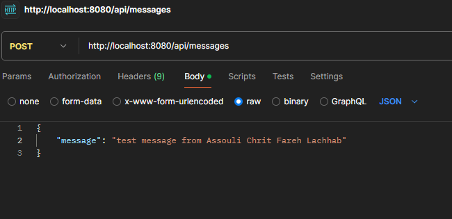
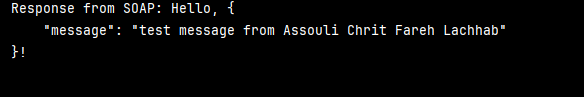

# SOA avec Spring


## 1. Requête REST à `http://localhost:8080/api/messages`
Cette requête est envoyée au service REST pour gérer les messages. Voici la capture d'écran de l'exécution de la requête dans **Postman**.





Le résultat dans la console de l’application :



**Détails de la requête :**
- **Méthode HTTP** : POST
- **URL** : `http://localhost:8080/api/messages`
- **Body** (JSON) :
  ```json
  {
    "message": "test message from Assouli Chrit Fareh Lachhab"
}


## 2. Requête SOAP à `http://localhost:8080/ws`
Cette requête est envoyée au service SOAP. Voici la capture d'écran de l'exécution dans **Postman** (ou l'outil de ton choix) :


**Détails de la requête :**
- **Méthode HTTP** : POST
- **URL** : `http://localhost:8080/ws`
- **Content-Type** : `text/xml`
- **Body** :
  ```xml
  <soapenv:Envelope xmlns:soapenv="http://schemas.xmlsoap.org/soap/envelope/" xmlns:ex="http://example.com/schema">
   <soapenv:Header/>
   <soapenv:Body>
      <ex:request>
         <ex:input>Assouli Chrit Fareh Lachhab</ex:input>
      </ex:request>
   </soapenv:Body>
  </soapenv:Envelope>


## 3. Accès au WSDL à `http://localhost:8080/ws/myService.wsdl`
Voici la capture d'écran de l'accès au fichier WSDL généré pour le service SOAP.


**Détails de l'accès :**
- **URL** : `http://localhost:8080/ws/myService.wsdl`
- Ce fichier WSDL contient la définition des services exposés par l'application.

